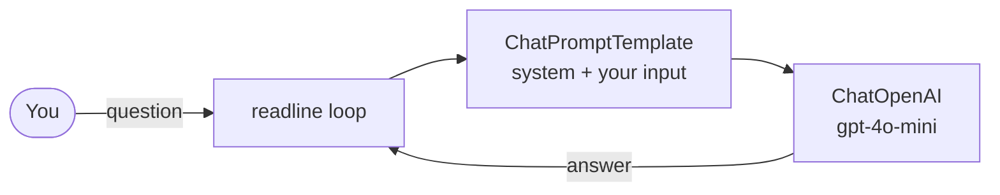

# AI Agent Coach (LangChain + Node.js)

A 61-line LangChain JS chat CLI that answers questions about building AI agents, from the "AI agent in 10 minutes"
tutorial.

## What it is

`agent.js` pipes a prompt template into an OpenAI chat model and wraps it in a terminal loop. The system prompt
makes the model an **AI Agent Coach**: it helps developers understand and build agents with LangChain and Node.js,
answers with short JavaScript examples, steers off-topic questions back, and keeps answers under 300 words.

**Why:** most agent tutorials start with many libraries at once. This is the smallest LangChain program that talks
back, so you can see each moving part before adding memory and tools.

What it is not (yet): there is no conversation memory (each question is sent on its own) and no tools, so strictly
it is a chain, not a tool-using agent. See [Extending](#extending).

## Features

- One file, one command to run
- LangChain JS `ChatPromptTemplate` + `ChatOpenAI` (`gpt-4o-mini`, temperature 0.4)
- A ready-made "AI Agent Coach" system prompt you can edit
- Simple terminal chat; type `exit` to quit

## Architecture



| Part | Where |
|---|---|
| Model setup | `agent.js` lines 6–10 |
| System prompt | `agent.js` lines 12–32 |
| Chain (`prompt.pipe(model)`) | `agent.js` line 35 |
| Terminal loop | `agent.js` lines 37–61 |

## Quick start

Requirements: **Node.js 20 or newer** (the LangChain 1.x packages need it) and an OpenAI API key.

```bash
git clone https://github.com/avnishyadav25/ai-agent-10-min.git
cd ai-agent-10-min
npm install
```

Create a `.env` file in the project root (it is git-ignored):

```text
OPENAI_API_KEY=<YOUR_OPENAI_API_KEY>
```

Run it:

```bash
node agent.js
```

```text
🤖 AI Agent ready! Type your question (or 'exit' to quit):

You: What's the difference between a chain and an agent?
```

Node prints a `MODULE_TYPELESS_PACKAGE_JSON` warning on start because `package.json` doesn't declare
`"type": "module"`; the script still runs. Add `"type": "module"` to `package.json` to silence it.

## Environment

| Name | Purpose |
|---|---|
| `OPENAI_API_KEY` | OpenAI key used by `ChatOpenAI` (read from `.env` by `dotenv`) |

## Usage tips

- Change the coach's behaviour by editing the system prompt in `agent.js`.
- Change `modelName` (for example `gpt-4o`) and `temperature` in `agent.js` to trade cost, speed and creativity.
- API errors (wrong key, no credit) are not caught yet, so the program exits on the first failed question. Check
  `OPENAI_API_KEY` if that happens.

## Extending

Ideas, in the order I'd add them:

1. **Memory:** keep the message history and pass it with each question (a `MessagesPlaceholder` in the prompt).
2. **One tool:** bind a tool (for example a docs search or a calculator) with `model.bindTools(...)` and handle tool
   calls in a loop; that is the step that makes it an agent.
3. **Streaming:** use `chain.stream(...)` to print answers as they arrive.
4. **Error handling:** wrap `chain.invoke` in `try/catch` so a failed call doesn't end the session.

## Demo

- Demo video: _coming soon_ <!-- TODO: add the YouTube link -->
- Project write-up: _coming soon_ <!-- TODO: https://avnishyadav.com/projects/ai-agent-in-10-minutes once published -->

## License

No license file has been added yet. <!-- TODO (owner): add a LICENSE file and update this line. -->

## Author

Built by **Avnish Yadav**, AI automation engineer.

- Website: [avnishyadav.com](https://avnishyadav.com)
- YouTube: [@avnishcodes](https://www.youtube.com/@avnishcodes)
- LinkedIn: [avnishyadav25](https://in.linkedin.com/in/avnishyadav25)
- GitHub: [avnishyadav25](https://github.com/avnishyadav25)
