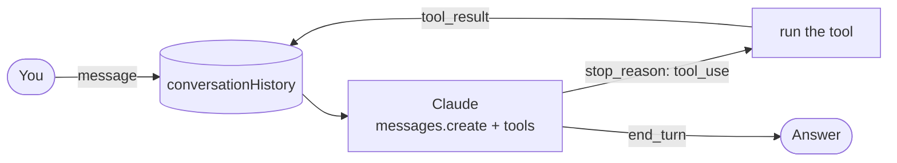

# AI Agent in 10 Minutes (Node.js + Claude)

A minimal AI agent in one file: Claude through the official Anthropic SDK, a tool-use loop with one real tool, and
short-term conversation memory. It is the companion code for the post
[How to Build an AI Agent in 10 Minutes](https://avnishyadav.com/blogs/how-to-build-ai-agent-nodejs).

## What it does

- Chats with Claude in your terminal (`exit` to quit), or replays three scripted messages with `--demo`.
- Remembers the conversation: every turn is kept in an array and sent with each request.
- Lets Claude call a tool, `get_current_time`, which reads your machine's clock. No network, shell or file access.
- Handles the cases the loop can hit: tool errors (sent back as `is_error` results), more than 5 tool rounds in a row,
  `max_tokens` cut-offs, refusals, and API errors (bad key, rate limit, network), with a short message instead of a
  crash. A failed turn is removed from memory so the history stays valid.

## Quick start

Requirements: Node.js 20 or newer and an Anthropic API key from the
[Claude Console](https://platform.claude.com/).

```bash
git clone https://github.com/avnishyadav25/ai-agent-10-min.git
cd ai-agent-10-min
npm install
cp .env.example .env   # then put your key in .env (it is git-ignored)
```

```bash
npm start              # interactive chat
npm run demo           # "my name is Avnish" -> "what's the time?" (tool) -> "what's my name?" (memory)
```

```text
# example session (your output will differ)
You: What's the current time?
[tool] get_current_time {}
Agent: It's 10:42 AM on Saturday, October 3, 2026.
```

## Environment

| Name | Required | Purpose |
|---|---|---|
| `ANTHROPIC_API_KEY` | yes | Your Anthropic API key (read from `.env` by `dotenv`) |
| `ANTHROPIC_MODEL` | no | Model id; default `claude-opus-5-5` |

## How the loop works



1. Your message is pushed onto `conversationHistory` (the memory).
2. `client.messages.create({ model, max_tokens, messages, tools })` sends the whole history plus the tool list.
3. If `stop_reason` is `"tool_use"`, the full assistant `content` is appended unchanged, every `tool_use` block is run,
   and all results go back in **one** user message of `tool_result` blocks. Then it asks Claude again.
4. Any other `stop_reason` ends the turn; the text blocks are the answer.

Everything is in `agent.js`: tools (section 1–2), the agent and loop (3), error messages (4), the CLI (5).
To add a tool, add a definition to `tools` and a function with the same name to `toolFunctions`.

Notes on the model: Claude Opus 5.5 always uses adaptive thinking and its default effort is `medium`; this code
leaves both at their defaults, so it also runs if you set `ANTHROPIC_MODEL` to another current model. Thinking blocks
can appear in responses; they are kept in memory as returned and not printed.

## Where it matches the post

| Post | This repo |
|---|---|
| `npm install @anthropic-ai/sdk dotenv`, CommonJS `require` | Same |
| Memory = an array of messages sent with every call | `conversationHistory` in `createAgent` |
| `get_current_time` tool with an empty `input_schema` | Same tool, same shape |
| `tools` passed to `messages.create`, loop while `stop_reason === "tool_use"` | Same |
| Push the assistant `content` (with the `tool_use` block) before the `tool_result` | Same |
| Safety break after 5 tool calls | `MAX_TOOL_ROUNDS = 5` |
| Demo: name, time, memory question | `npm run demo` |

Where it differs, following Anthropic's docs as of 2026-10-03:

- Model `claude-opus-5-5` instead of `claude-3-haiku-20240307`, which was retired on 2026-04-20.
- One assistant message and **one** user message with all `tool_result` blocks per round (the post pushes an
  assistant + user pair per tool call, which breaks when Claude calls two tools at once).
- The final assistant turn is stored as the full `response.content`, not just its text, and only `text` blocks are
  printed (the post's `.map(block => block.text)` returns `undefined` for non-text blocks).
- API errors are caught and explained; refusals and `max_tokens` cut-offs are handled.
- An interactive chat instead of only the three hard-coded calls.

## Tests

```bash
npm test
```

Runs offline with Node's built-in test runner and a stubbed Anthropic client (no key, no network): tool round trip,
parallel tool calls in one message, unknown/failing tools, memory carry-over, the 5-round safety break, refusals,
and an API error raised by the real SDK client against a stubbed `fetch` (memory is rolled back).

## Tested with

- `npm test`: 9/9 passing on Node 20.20.2 and Node 23.11.0, `@anthropic-ai/sdk` 0.131.0, 2026-10-03.
- Not yet run against the live API (needs a key): that is the owner's first step.

## Sources

Checked on 2026-10-03:

- [Models overview](https://platform.claude.com/docs/en/about-claude/models/overview): "start with Claude Opus 5.5
  for most workloads"; Opus 5 and Sonnet 5 listed as legacy.
- [Model deprecations](https://platform.claude.com/docs/en/about-claude/model-deprecations): `claude-3-haiku-20240307`
  retired 2026-04-20.
- [Tool use overview](https://platform.claude.com/docs/en/agents-and-tools/tool-use/overview) and
  [Handle tool calls](https://platform.claude.com/docs/en/agents-and-tools/tool-use/handle-tool-calls): tool
  definition shape, `tool_result` placement, `is_error`.
- [Handling stop reasons](https://platform.claude.com/docs/en/build-with-claude/handling-stop-reasons): `tool_use`,
  `max_tokens`, `refusal`.
- [`@anthropic-ai/sdk` on npm](https://www.npmjs.com/package/@anthropic-ai/sdk): 0.131.0 is `latest`.

## Author

Built by **Avnish Yadav**: [avnishyadav.com](https://avnishyadav.com)
